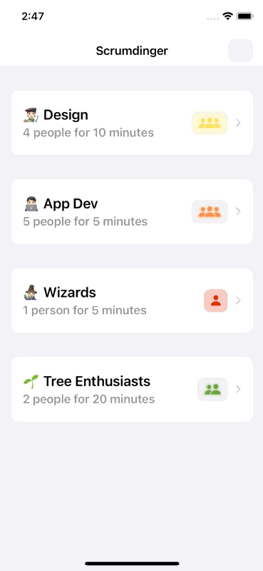
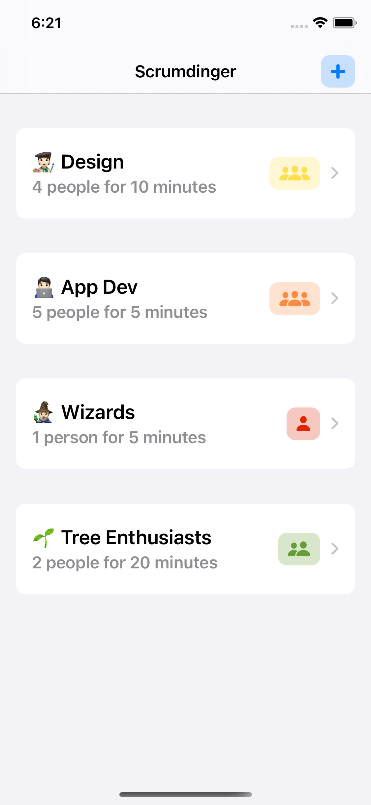
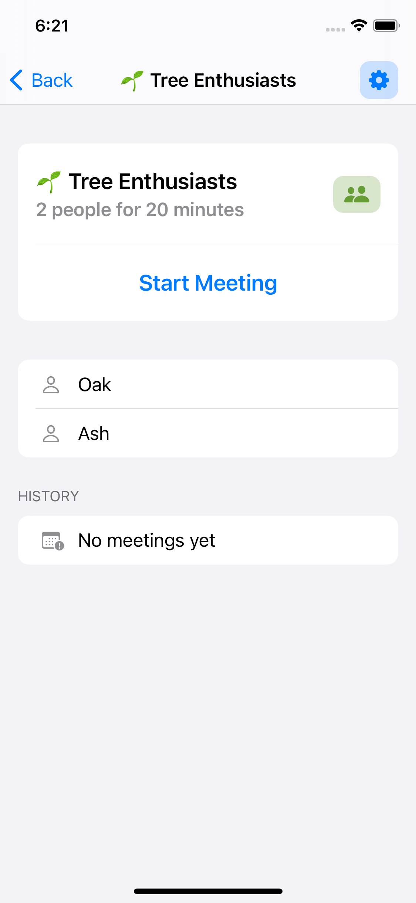
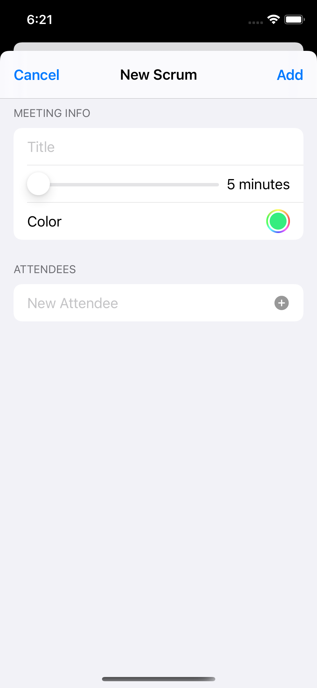
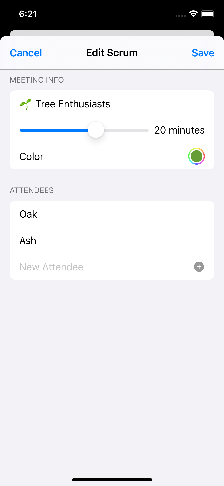
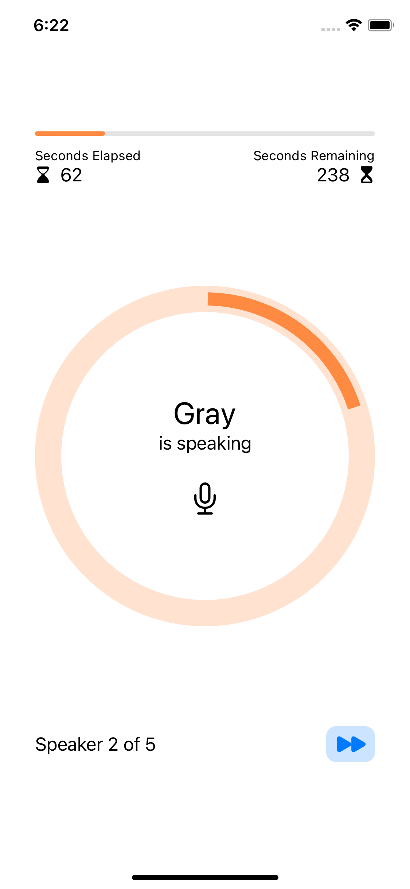
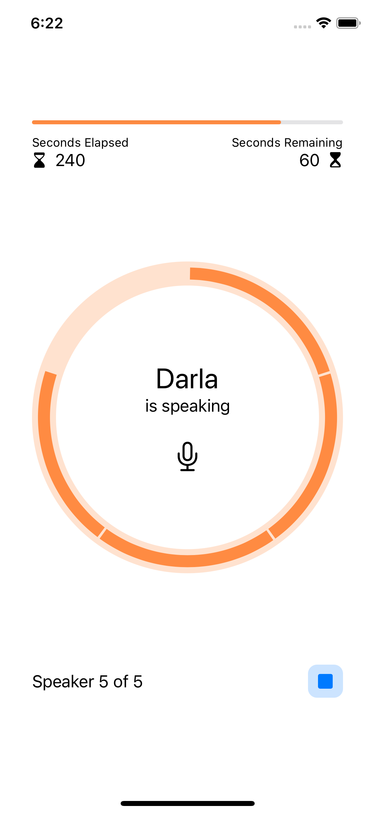

# scrumdinger

    
    
    
    

Code walkthrough of [https://developer.apple.com/tutorials/app-dev-training](https://developer.apple.com/tutorials/app-dev-training).

## Further enhancements

### List View

- Icons and caption text update based on number of attendees
- Made the screen more appealing
- Updated title to the name of the app

### Details View

- Simplify information shown (but sacrifices simplicity for reduced accessibility)
- Center align and enlarge main action
- Remove color from labels that are not interactable

### New Scrum View

- Added `New Scrum` title
- Rename `Dismiss` to `Cancel`

### Edit Scrum View

- Changed title to `Edit Scrum` instead of using the title (inaccurate when changed)
- Rename `Done` to `Save`
- Presented as a sheet rather than full screen for consistency with New

### Meeting View

- Presented as a full screen for focus on content
- Updated background style to make it less jarring
- Themed progress bar based on scrum color

- Added stop button to end the meeting
